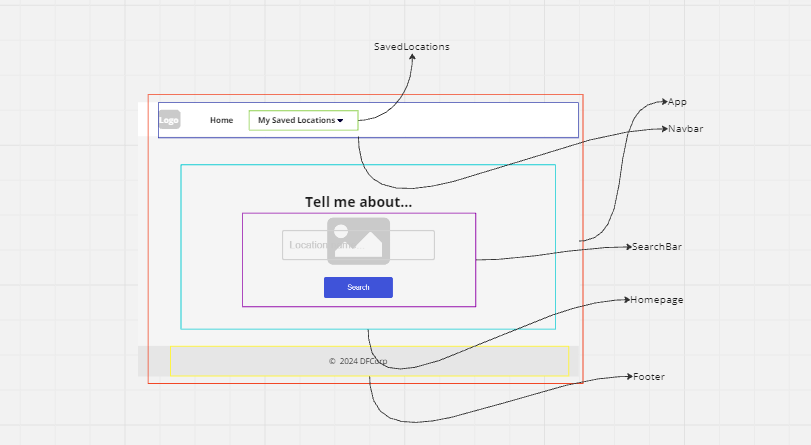
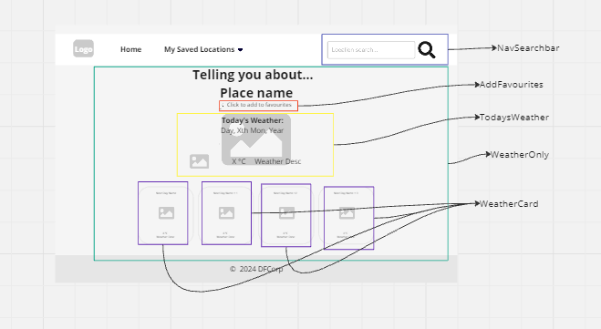
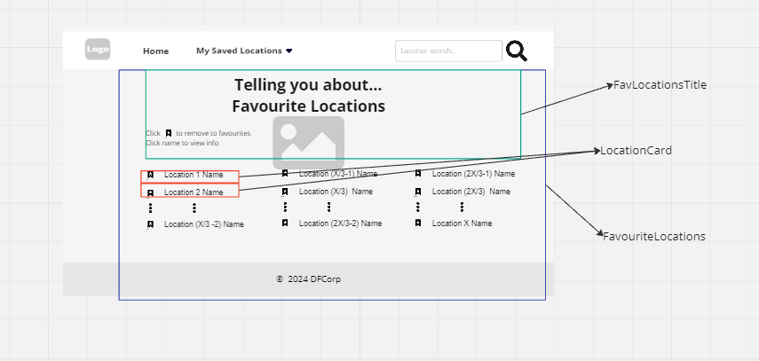
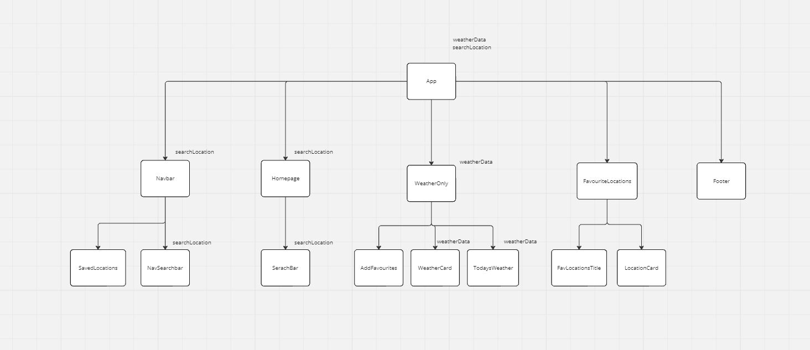

# Challenge 4 Planning

## User Stories

1. As a user, I want to be able to search for any town or city on the homepage, so that I can check the weather in different places.
2. As a user, I want to be able to view the forecast for the next 5 days, so that I can see the upcoming weather.
3. As a user, I want to be able to register an account with an email and password, So that I can login to the service.
4. As a user, I want to be able to log in to my account, so that I can access my account.
5. As a user, I want to be able to add locations to my favourites, so that I can review them later.
6. As a user, I want to be able to remove locations to my favourites, so that I can clean up unused locations.
7. As a user, I want to be able to manage my favourites on a separate page, so that I can manage all my favourite locations.
8. As a user, I want the application to be responsive for my different devices, so that the display looks good across my devices.

## Component Hierarchy

## Testing Login details

Username: Test
Password : Password1!